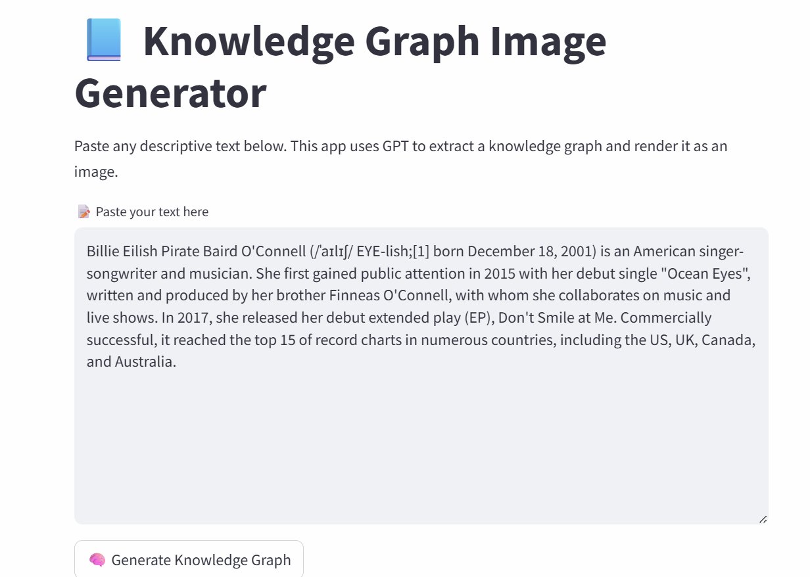
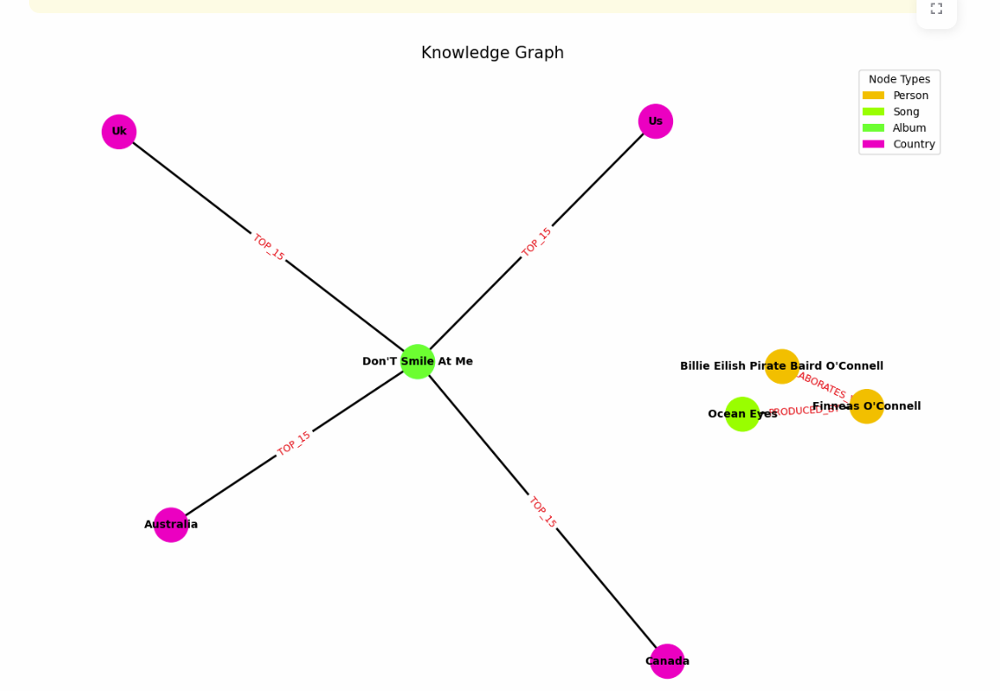

# Text-to-Knowledge-Graph

A Streamlit app that uses GPT (via LangChain) to extract a knowledge graph from descriptive text and visualize it as an image.

#### 🚀 Try the demo:
https://text-to-knowledge-graph.streamlit.app/

(Note: the main dev is poor so if you cannot test this out, it means she ran out of OpenAI credit. You can wait for her to deploy a model herself or reproduce the project with the instructions below.)


## Features

- Paste any descriptive text and generate a knowledge graph using GPT-4.
- Visualizes entities and relationships as a directed graph.
- Node colors represent different entity types, with a legend for clarity.
- Raw GPT output is displayed for transparency.

## Demo


## Getting Started

### 1. Clone the Repository

```sh
git clone https://github.com/yourusername/text-to-knowledge-graph.git
cd text-to-knowledge-graph
```

### 2. Set Up Environment

Create a virtual environment and activate it:

```sh
python -m venv venv
venv\Scripts\activate  # On Windows
```

Install dependencies:

```sh
pip install -r requirements.txt
```

### 3. Configure Secrets

Create a .streamlit directory and a `secrets.toml` file for your OpenAI API key:

```
.text-to-knowledge-graph/
  .streamlit/
    secrets.toml
```

Add your OpenAI API key to secrets.toml:

```toml
[default]
OPENAI_API_KEY = "sk-..."
```

### 4. Run the App

```sh
streamlit run app.py
```

## Usage

1. Paste your descriptive text into the input box.
2. Click **"🧠 Generate Knowledge Graph"**.
3. View the extracted graph and raw GPT output.

## Project Structure

```
app.py                      # Streamlit app entry point
graph_functions.py          # Core logic for extraction and visualization
experiment/                 # Frontend experiments (JS/CSS libs)
  experiment.ipynb
  lib/
    bindings/
    tom-select/
    vis-9.1.2/
```

## Dependencies

- [Streamlit](https://streamlit.io/)
- [LangChain](https://python.langchain.com/)
- [OpenAI](https://platform.openai.com/)
- [NetworkX](https://networkx.org/)
- [Matplotlib](https://matplotlib.org/)

## Notes

- Requires an OpenAI API key with access to GPT-4.
- Do **not** commit your `secrets.toml` to public repositories.

## License

MIT License

---

*Created by ngavu2004.*